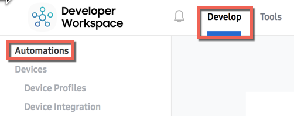
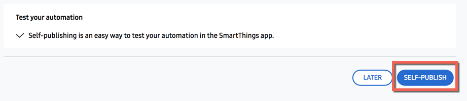
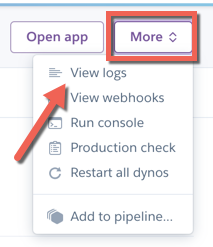

# First Automation SmartApp

This is a prototype of an example first Automation SmartApp. It attempts to:

- Enable developers to get something running _quickly_ using [Glitch](https://glitch.com) or [Heroku](https://heroku.com) for push-button deployment.
- Requires no physical devices to install - just a Samsung account is all that is needed.

## Prerequisites

- A [Samsung Account](https://account.samsung.com/membership/index.do)
- The SmartThings mobile application
    - [iOS](https://itunes.apple.com/us/app/smartthings-samsung-connect/id1222822904?mt=8&uo=4)
    - [Android](https://play.google.com/store/apps/details?id=com.samsung.android.oneconnect)

## Remix and host with Glitch

[Glitch](https://glitch.com) is a collaborative tool that gives developers instant access to free hosting and automated deployment. It includes a built-in editor, and any changes you make are instantly deployed. If you are looking to get started quickly, we recommend creating a Glitch Remix from this example.

### Steps:

_1. Create a Glitch Remix_ 

_2. Launch Glitch app_

In Glitch, click the _Show_ button: 

Copy the URL of the page launched from the step above. It should look like `https://{app-name}.glitch.me`

_3. Create Automation app_

Using a Samsung account, log in to the [Developer Workspace](https://devworkspace.developer.samsung.com/smartthingsconsole/iotweb/site)

From the _Develop_ section, click _Automations_ in the left-hand menu:

 
- Click the _New Automation_ button.
- Enter a _Display name_, _Automation name_, and _Description_.
- For the _Target URL_ field, enter the URL of your Glitch app from Step 2 above.
- Click the _Add_ button for the _Scopes_ field, and select a scope (any scope is fine).
- Click _Save_
- Click the _Self Publish_ button on the bottom of the next step:

_4. Install Automation app_

- [Enable Developer Mode](https://smartthings.developer.samsung.com/docs/guides/testing/developer-mode.html#Enable-Developer-Mode) in the SmartThings mobile application.
- In the SmartThings mobile application, press _Automations_, then the _+_ button to add a new Automation.
- Choose a Location, then press your Automation SmartApp to begin installation.

## Deploy to Heroku

[Heroku](https://heroku.com) is a cloud hosting provider, and it offers a free tier that is ideal for learning or personal projects.

### Steps

_1. Deploy app to Heroku_

Provide a Heroku app name, and then click the _Deploy app_ button. You'll see some logs as Heroku builds and deploys the application.

The URL of the app (that will be used to register the application with SmartThings), will be `https://<your-heroku-app-name>.herokuapp.com`.

_2. Create Automation app_

Using a Samsung account, log in to the [Developer Workspace](https://devworkspace.developer.samsung.com/smartthingsconsole/iotweb/site)

From the _Develop_ section, click _Automations_ in the left-hand menu:

 
- Click the _New Automation_ button.
- Enter a _Display name_, _Automation name_, and _Description_.
- For the _Target URL_ field, enter the URL of your Heroku app from Step 1 above.
- Click the _Add_ button for the _Scopes_ field, and select the `r:schedules` scope.
- Click _Save_
- Click the _Self Publish_ button on the bottom of the next step:

_3. Install Automation app_

- [Enable Developer Mode](https://smartthings.developer.samsung.com/docs/guides/testing/developer-mode.html#Enable-Developer-Mode) in the SmartThings mobile application.
- In the SmartThings mobile application, press _Automations_, then the _+_ button to add a new Automation.
- Choose a Location, then press your Automation SmartApp to begin installation.

### Viewing application logs

To view logs in Heroku, from the application in Heroku, click the _More_ button, then the _View logs_ option:

